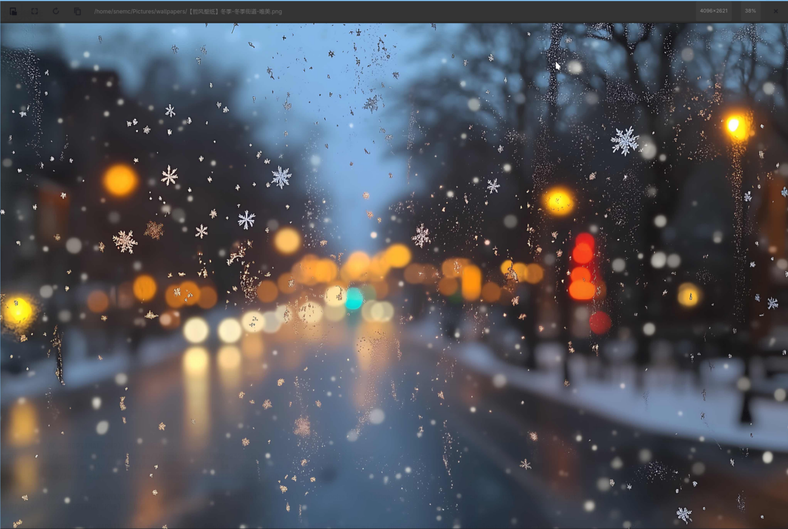

# Image Viewer 图片查看器

一个轻量、快速的 Wayland 图片查看器，使用 GTK4 和 Rust 构建。

[English](README.md)

## 功能特性

- **快速渲染** - Cairo 硬件加速
- **置顶模式** - 使用 wlr-layer-shell 将图片置于最上层（仅 Wayland）
- **直观操作** - 滚轮缩放、拖动平移、双击切换置顶
- **极简界面** - 自定义标题栏，仅保留必要控件
- **图片操作** - 旋转、复制到剪贴板、适应窗口

## 截图



## 安装

### 运行依赖

- GTK4 (>= 4.14)
- gdk-pixbuf2
- cairo
- pango
- wayland（置顶模式需要）
- gtk4-layer-shell

**Arch Linux:**
```bash
sudo pacman -S gtk4 cairo pango wayland gtk4-layer-shell
```

**Ubuntu/Debian:**
```bash
sudo apt install libgtk-4-1 libcairo2 libpango-1.0-0 libwayland-client0
# gtk4-layer-shell 可能需要从源码编译
```

**Fedora:**
```bash
sudo dnf install gtk4 cairo pango wayland gtk4-layer-shell
```

### 编译依赖

- Rust (>= 1.75)
- Cargo
- pkg-config
- GTK4 开发文件
- Cairo 开发文件
- gtk4-layer-shell 开发文件

**Arch Linux:**
```bash
sudo pacman -S rust pkg-config gtk4 cairo gtk4-layer-shell
```

**Ubuntu/Debian:**
```bash
sudo apt install rustc cargo pkg-config libgtk-4-dev libcairo2-dev
# gtk4-layer-shell-dev 可能需要从源码编译
```

**Fedora:**
```bash
sudo dnf install rust cargo pkg-config gtk4-devel cairo-devel gtk4-layer-shell-devel
```

### 编译

```bash
git clone https://github.com/user/image-viewer.git
cd image-viewer
cargo build --release
```

二进制文件位于 `target/release/image-viewer`。

### 安装（可选）

```bash
# 二进制文件
sudo cp target/release/image-viewer /usr/local/bin/

# 桌面入口
sudo cp image-viewer.desktop /usr/share/applications/

# 图标
sudo cp assets/image-viewer.svg /usr/share/icons/hicolor/scalable/apps/
```

## 使用方法

```bash
# 打开图片
image-viewer /path/to/image.png

# 或通过文件管理器打开
```

### 操作说明

| 操作 | 普通模式 | 置顶模式 |
|------|----------|----------|
| 缩放 | 滚轮 | 滚轮 |
| 平移 | 左键拖动 | 左键拖动（移动窗口） |
| 进入置顶 | 双击 | - |
| 退出置顶 | - | 双击 |
| 关闭 | 关闭按钮 | 右键点击 |

### 置顶模式

双击图片进入置顶模式。图片将使用 Wayland layer-shell 协议固定在所有窗口之上。适用于在工作时参考图片。

## 许可证

MIT 许可证 - 查看 [LICENSE](LICENSE)

## 贡献

欢迎提交 Issue 和 Pull Request！
